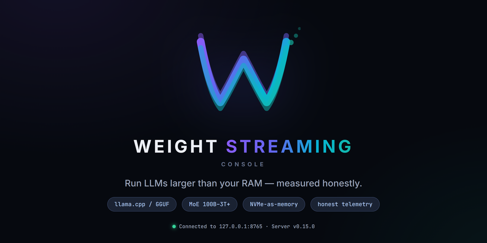
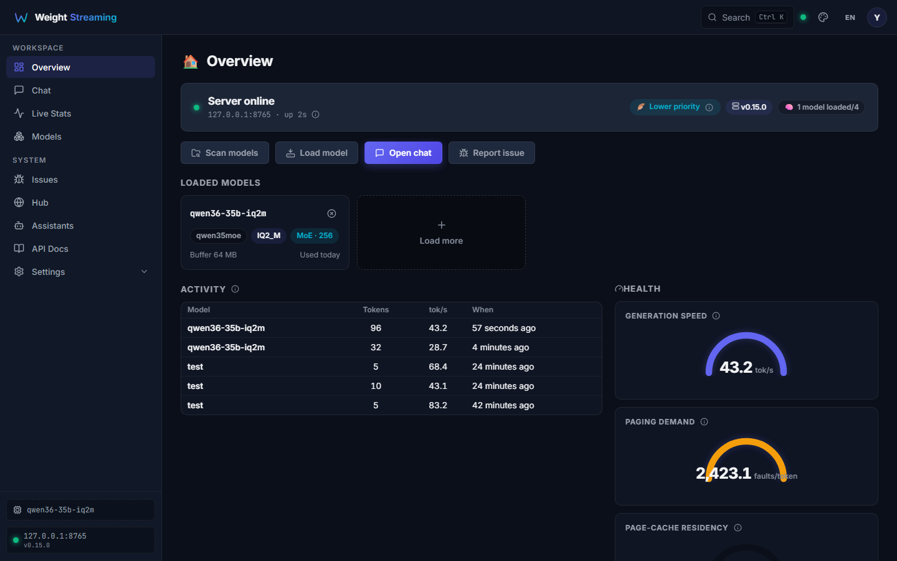
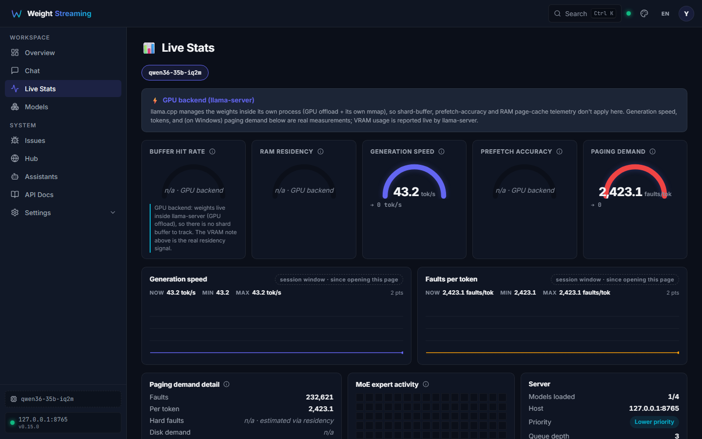
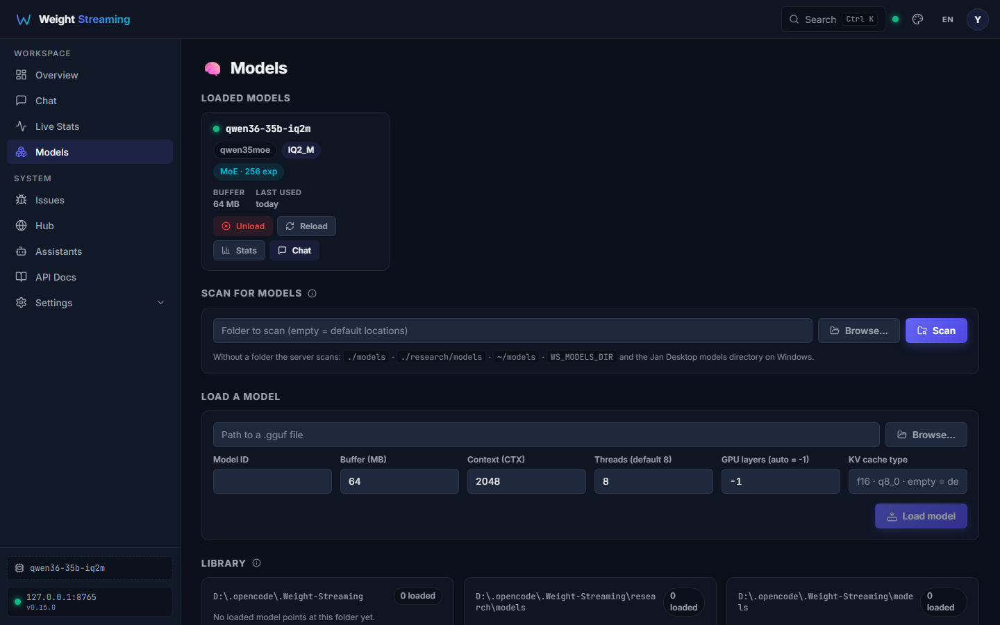
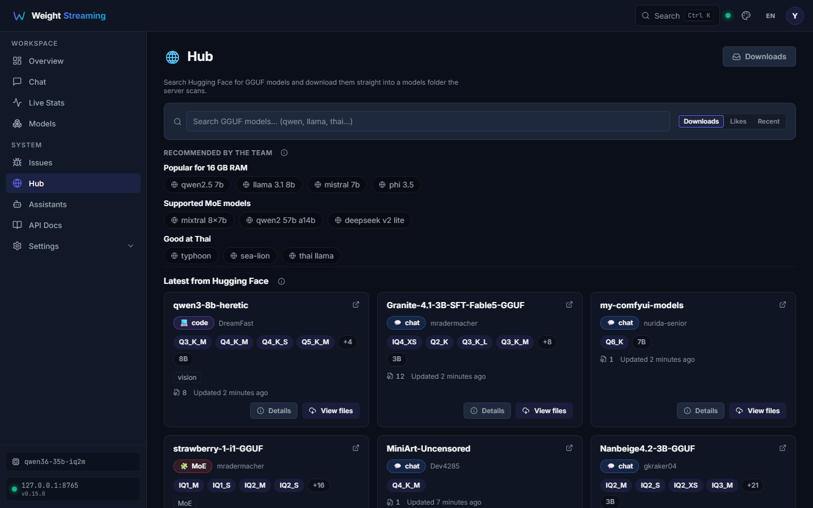
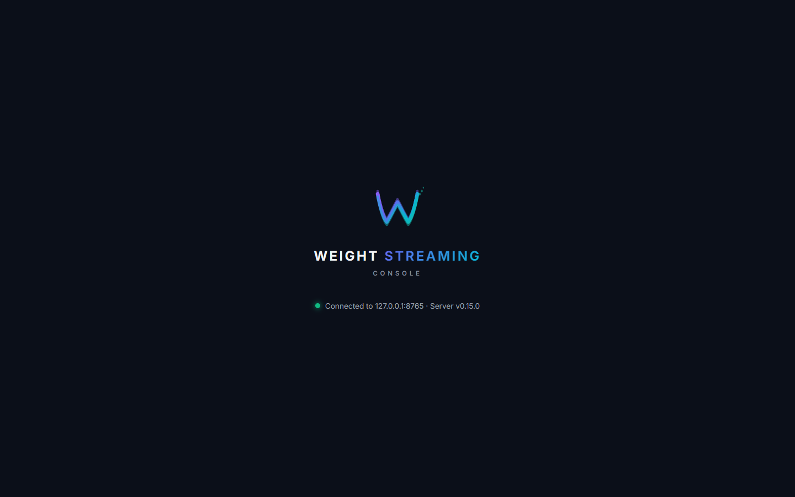
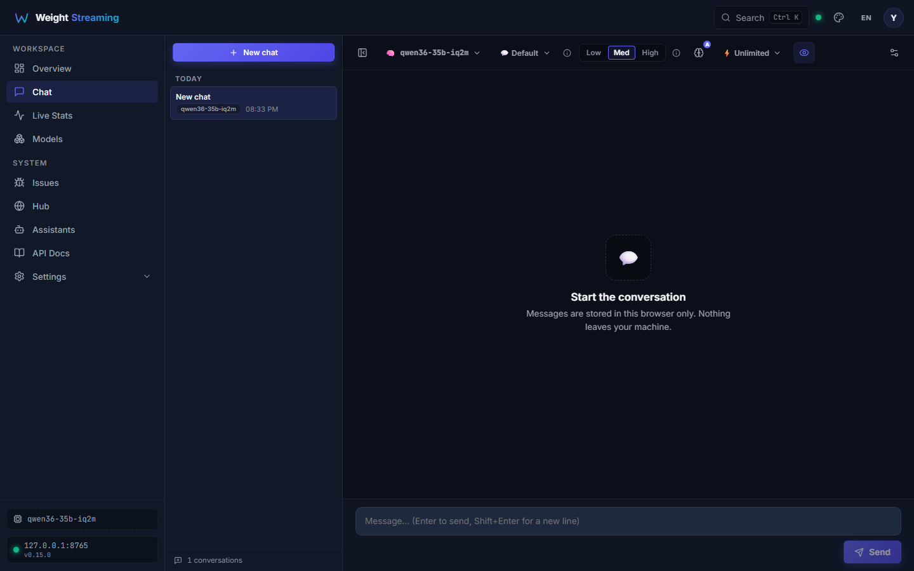

# weight-streaming

<p align="center">
  
  <br><em>The console logo, tagline and honest-telemetry promise — built from the app's own brand assets.</em>
</p>

**Run LLMs larger than your RAM — using NVMe as an extension of memory, measured honestly.**

[](https://github.com/i-mrDed/weight-streaming/actions/workflows/ci.yml)
[](https://github.com/i-mrDed/weight-streaming/releases)
[](LICENSE)
[](.github/workflows/ci.yml)

`weight-streaming` is a **local, out-of-core inference platform** for large
language models (100B–3T+ parameters, especially MoE like DeepSeek,
Qwen and Kimi) on consumer hardware with 32–64 GB RAM and a 12 GB GPU.
Instead of pretending a 104 GB model fits in 12 GB of VRAM, it runs the
model anyway — memory-mapping the GGUF from NVMe and streaming weights
as needed — and **reports the real cost**: tok/s, page faults per token,
and disk traffic. You can see exactly what the machine is doing and where
the bottleneck is. The project's ground rule is **honest telemetry**:
every number comes from real measurement, or it shows `n/a` — never a
fabricated value.

## Features

- **API server** — OpenAI-compatible `/v1/*` endpoints plus Anthropic
  `/v1/messages` and an SSE `/v1/generate`. Model load/unload with
  per-model context length, threads, GPU layers and KV-cache type,
  request queueing, live stats, usage history, log tailing, and an issue
  tracking system.
- **Web console** — SPA at `http://localhost:8765/console/` (the root
  `/` redirects there; the pre-P6 UI is kept at `/app-legacy` for one
  release as a rollback path). Chat with streaming thinking/answer
  separation, live stats (tok/s, page-fault demand, VRAM), model library
  with a quant advisor, hub downloads with progress, assistants, MCP
  settings, issue reports, i18n (TH/EN), and a theme registry.
- **Dual backend** — llama-server subprocess (GPU offload with
  `-ngl` / `--n-cpu-moe`, native reasoning control, real subprocess
  page-fault telemetry) and the llama-cpp-python CPU binding, with
  graceful fallback between them.
- **Assistants** — CRUD store with system prompts, selectable in chat,
  and used as a safety guard so a model an assistant still references
  cannot be deleted from the hub.
- **MCP host** — manage stdio/SSE MCP servers and list/call their tools
  (P7.4).
- **Hub** — download GGUF models directly from Hugging Face: sharded
  repos, per-quant subdirectories, Xet storage, resumable `.part`
  downloads with a GGUF structural gate (byte-count parity +
  header/tensor-table parse) before rename, plus delete / clear / reveal
  endpoints.
- **CLI / TUI / Gradio** — `weight-streaming` ships `run`, `stats`,
  `benchmark`, `server` (alias `serve`), `auto-tune`, `repack`,
  `inspect`, `ui` (Gradio), `tui` (Textual) and `issues` subcommands.
- **CPU etiquette** — inference child processes run below-normal
  priority by default so the desktop, browser and IDE stay usable while
  a 100 GB model thrashes CPU and disk.

## Screenshots

<p align="center">
  <video src="docs/screenshots/demo-chat.mp4" poster="docs/screenshots/03-stats.png" width="70%" autoplay loop muted playsinline>
    <source src="docs/screenshots/demo-chat.mp4" type="video/mp4">
    <source src="docs/screenshots/demo-chat.webm" type="video/webm">
    
  </video>
  <br><em>Real session: streaming chat (thinking + answer) on Qwen3.6-35B-A3B, ending on the live-stats page.</em>
</p>

<table>
<tr>
  <td align="center" width="50%"><br><b>Overview</b> — live server + model status</td>
  <td align="center" width="50%"><br><b>Live stats</b> — real tok/s, paging demand, VRAM</td>
</tr>
<tr>
  <td align="center" width="50%"><br><b>Model library</b> — load, quant advisor, KV/GPU controls</td>
  <td align="center" width="50%"><br><b>Hub</b> — resumable GGUF downloads</td>
</tr>
<tr>
  <td align="center" width="50%"><br><b>Boot splash</b> — real screen, real connection status</td>
  <td align="center" width="50%"><br><b>Chat</b> — streaming with thinking/answer separation</td>
</tr>
</table>

More: [chat](docs/screenshots/06-chat.png) · [settings](docs/screenshots/04-settings.png)

## Real measured results (EXP-012, 2026-08-10)

Machine: i9-9900KF (8C/16T), RTX 3060 12 GB, 64 GB RAM.

| model | size | config | cold | warm | verdict |
|---|---|---|---:|---:|---|
| Qwen3.6-35B-A3B IQ1_M | 10 GB (fits VRAM) | `n-cpu-moe 0 -t 8` | **75.9 tok/s** | 73.9 | GPU-bound, light CPU |
| Qwen3.6-35B-A3B IQ1_M | 10 GB | `--cpu-moe` (all experts CPU) | 14.2 | 14.6 | CPU-bound |
| DeepSeek-V4-Flash-0731 UD-IQ3_XXS | **104 GB** | `--cpu-moe -t 8` | 1.48 | 1.76 | **disk-bound** |
| DeepSeek-V4-Flash-0731 UD-IQ3_XXS | 104 GB | `--n-cpu-moe 42 -t 8` | 1.46 | **1.89** | disk-bound |
| DeepSeek-V4-Flash-0731 UD-IQ3_XXS | 104 GB | `--cpu-moe -t 16` | **1.71** | 1.75 | disk-bound |
| DeepSeek-V4-Flash-0731 UD-IQ3_XXS | 104 GB | `n-cpu-moe 10` | — | — | **OOM** (77 GB → 12 GB VRAM) |

The honest headline: a 104 GB model **does run** on this 64 GB machine at
**~1.5–1.9 tok/s**, and the page-fault telemetry (36–77k faults per token,
≈150–300 MB read from disk per token) proves the bottleneck is the
disk→RAM→CPU pipeline — not the GPU, not the CPU. Config tweaks move the
number only ~15%. The path to 15–30+ tok/s is more RAM (128 GB keeps the
whole file in page cache) or more VRAM — see
[`research/experiments/EXP-012`](research/experiments/EXP-012-dsv4flash-103gb/)
and the
[`HARDWARE_100TPS_PLAN`](research/HARDWARE_100TPS_PLAN.md).
That is the whole point of the project: measure the real cost of running
models bigger than your hardware, then close the gap.

## How it works

Large models (especially MoE) only use a fraction of their parameters per
token. The platform:

1. **Memory-maps** the model file (zero-copy access, no redundant loading)
2. **Tracks** hot weight regions via the OS page cache (Windows
   `QueryWorkingSetEx` residency monitoring)
3. **Measures** the real paging demand per token (faults/tok, disk MB/tok)
4. **Streams** weights from NVMe as needed instead of loading everything
   into RAM
5. **Reports honestly** — every number on the stats page comes from real
   telemetry, never fabricated zeros

## Quick start

> **เครื่องใหม่? ไม่ต้องติดตั้ง Jan** — ระบบหา `llama-server` (llama.cpp) เอง ตามลำดับ:
> `WS_LLAMA_SERVER` → Jan backends → PATH — ใช้สคริปต์ด้านล่างจัดการให้อัตโนมัติ

```bash
# 1) dependencies (server extras: fastapi/uvicorn; test: pytest/httpx/requests)
pip install -e ".[server,test]"

# 2) ensure a llama-server binary (find existing, or download matching GPU)
python scripts/setup_llama_server.py --check     # มีอยู่แล้วไหม?
python scripts/setup_llama_server.py --write-env # ไม่มี → ดาวน์โหลด + เขียน .env (WS_LLAMA_SERVER=...)
#    --backend cuda|vulkan|metal|cpu  ระบุเองได้ (default: auto-detect GPU)

# 3) API server + web console (default port 8765)
weight-streaming server            # or: python -m weight_stream.server --port 8765

# 4) open http://localhost:8765/console/
```

> **หมายเหตุ GPU:** ควรใช้ build ที่ตรงกับ GPU ของเครื่อง (CUDA สำหรับ NVIDIA /
> Vulkan สำหรับ AMD/Intel / Metal สำหรับ Mac) — CPU-only build ทำงานได้แต่ช้ามาก
> (2–4 tok/s เทียบกับ CUDA 35–40 tok/s) · Linux/macOS ใช้ PATH หรือ `WS_LLAMA_SERVER` เช่นกัน

Other front doors:

```bash
weight-streaming run model.gguf -p "Hello"          # CLI generation
weight-streaming benchmark model.gguf --max-tokens 256
weight-streaming tui --server http://127.0.0.1:8765 # Textual TUI
weight-streaming ui                                 # Gradio web UI
```

## Configuration (environment variables)

All server options have an env-var form (`WS_*`), so the same config
applies to the SPA, CLI and API:

| Variable | Default | Meaning |
|---|---|---|
| `WS_PORT` / `WS_HOST` | `8765` / `127.0.0.1` | API server bind |
| `WS_MODELS_DIR` | platform model dir | Where the hub writes downloads / scans for models |
| `WS_N_THREADS` | half of logical cores | Default inference threads per model |
| `WS_N_CTX` | model default | Default context length |
| `WS_GPU_LAYERS` | `-1` (auto) | GPU offload: `-1` auto, `0` CPU-only, `N` offload N layers (llama-server backend) |
| `WS_KV_CACHE_TYPE` | empty (f16) | KV cache data type, e.g. `q8_0` to halve KV VRAM |
| `WS_BUFFER_MB` | `64` | Streaming buffer size for the CPU binding |
| `WS_IDLE_TIMEOUT` | `0` (keep loaded) | Seconds of idle before auto-unload |
| `WS_LOWER_PRIORITY` | `1` | Run inference children below-normal priority |
| `WS_MAX_MODELS` / `WS_MAX_REQUESTS` / `WS_QUEUE_DEPTH` | — | Concurrency limits |
| `WS_LOG_LEVEL` | `info` | Log verbosity |
| `WS_LLAMA_SERVER` | auto (Jan → PATH) | Explicit path to a `llama-server` binary (llama.cpp) — ใช้เมื่อไม่มี Jan หรือต้องการ build เฉพาะ |

Extra llama-server flags can be passed through with `WS_LLAMA_EXTRA_ARGS`
(e.g. `--cpu-moe`, `--n-cpu-moe`, `-fa`).

## Downloading big models (hub)

Models are downloaded from Hugging Face through the hub — sharded repos,
per-quant subdirectories, resumable partials, and a GGUF structural gate
(byte-count parity + header/tensor-table parse) before a `.part` is ever
renamed into place. Downloads survive restarts, can be paused/resumed per
task, and deletion is guarded against models an assistant still
references. Files land in the configured models dir (`WS_MODELS_DIR`, else
the default locations incl. `~/models`) — see
[`docs/MODEL_INVENTORY.md`](docs/MODEL_INVENTORY.md) for where each model
lives on this machine. See `scripts/download_dsv4flash.py` and
[`research/experiments/EXP-012-dsv4flash-103gb/`](research/experiments/EXP-012-dsv4flash-103gb/)
for the 104 GB DeepSeek-V4-Flash walkthrough (download + measure + the
honest verdict).

## API overview

| Family | Endpoints |
|---|---|
| Chat / generate | `POST /v1/chat/completions`, `POST /v1/messages` (Anthropic), `POST /v1/generate` (SSE) |
| Models | `GET /v1/models`, `POST /v1/models/load`, `POST /v1/models/unload`, `GET /v1/models/scan` |
| Telemetry / config | `GET /v1/stats`, `GET/PATCH /v1/config`, `GET /v1/hardware`, `GET /v1/usage/history`, `GET /v1/logs/tail` |
| Hub | `GET /v1/hub/search`, `GET /v1/hub/model/{repo}`, `POST /v1/hub/download`, `GET /v1/hub/downloads`, `POST /v1/hub/download/{id}/{cancel,resume,delete,reveal}`, `POST /v1/hub/downloads/clear` |
| Assistants | `GET/POST /v1/assistants`, `GET/PATCH/DELETE /v1/assistants/{id}` |
| Issues | `GET/POST /v1/issues`, `GET/PATCH /v1/issues/{id}`, `GET /v1/issues/export` |
| System | `GET /health`, `GET /api`, `GET /v1/browse`, `GET /v1/browse-dir` |

## Tests & CI

GitHub Actions runs on every push/PR (`windows-latest` for Python,
`ubuntu-latest` for the frontend): the full Python suite (~300 tests:
hub download semantics, API contract, backends, telemetry, process
priority, config, security hardening) plus frontend `vitest`, `tsc
--noEmit` typecheck and a production `vite build` of the console. Locally:

```bash
python -m pytest           # full Python suite
cd frontend && npm ci && npm run typecheck && npm run build
```

## Documentation & research

- [`docs/`](docs/) — architecture, ADRs/decisions, model guide, model
  inventory (download locations), issue system, IDE integration,
  dashboard-theme spec
- [`research/experiments/`](research/experiments/) — EXP-001…EXP-017:
  buffer/prefetch simulation, KV-cache scaling, MoE CPU/GPU tiering,
  quant quality (Thai tonal probes), spec-decode dead-end, IQ1_M vs
  IQ2_M, DS V4 Flash >RAM measurement, CPU-lane dead-end, kimi-k3-in-c
  deep-research
- [`research/HARDWARE_100TPS_PLAN.md`](research/HARDWARE_100TPS_PLAN.md) —
  hardware roadmap calibrated with measured results (2026-08-10 market
  prices)
- [`CHANGELOG.md`](CHANGELOG.md) — semantic-version release history

## Repository layout

```
weight_stream/        core package: backends, server, hub, issues, io, tui, ui, gguf
frontend/             Vite/React console (built into weight_stream/server/static/console)
scripts/              measurement/download harnesses (EXP-00x)
tests/                Python test suite
research/             experiments + hardware plan + deep-research notes
docs/                 architecture, ADRs, guides
```

## License

MIT (see `pyproject.toml`).
